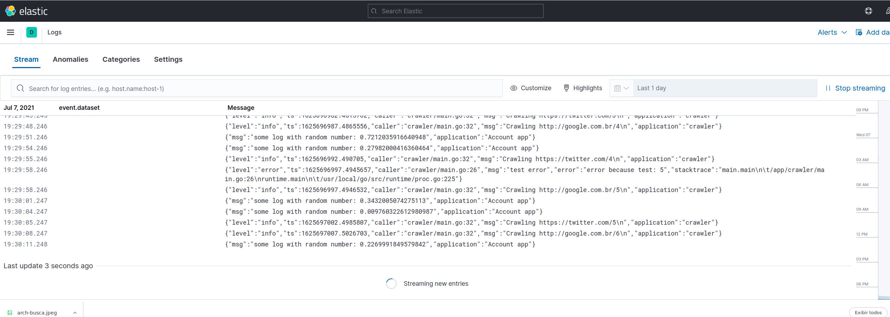

Obs Projects
---

This project show how some observability can be applied to web app / services

> In this case, this repository has applications surrounded by logs, metrics, and traces that are often known as the three pillars of observability

### Stack
- Golang
- Nodejs
- Elixir
- ELK

### Start project
```
$ docker-compose up
```

After containers starts you can visit `localhost:5601` to access `kibana`, so in Menu > Observability > Logs you're able to see log writing:




### Todo
- [X] Emit logs with filebeat
- [ ] Add metrics system
- [ ] Add tracing
- [ ] Add kubernetes example
